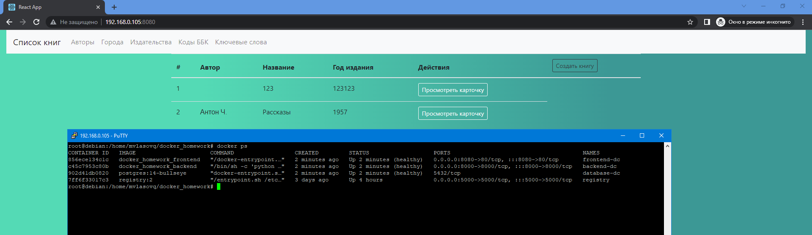

# docker_homework
# 1 Лекция
Написать Dockerfile для frontend располагается в директории /frontend, собрать и запустить
# 2 Лекция
Написать Dockerfile для backend который располагается в директории /lib_catalog(для сборки контейнера необходимо использовать файл /lib_catalog/requirements.txt), для работы backend необходим postgresql, т.е. необходимо собрать 2 контейнера:
1. backend
2. postgresql

Осуществить сетевые настройки, для работы связки backend и postgresql
# 3 Лекция
Написать docker-compose.yaml, для всего проекта, собрать и запустить

# Критерий оценки финального задания
1. Dockerfile должны быть написаны согласно пройденным best practices
2. Для docker-compose необходимо использовать локальное image registry
3. В docker-compose необходимо сетевые настройки 2 разных интерфейса(bridge), 1 - для фронта, 2 - для бека с postgresql

4.* Осущeствить сборку проекта самим docker-compose команда docker-compose build(при использовании этого подхода необходимо исключить 2 пункт из критерии оценки)

------------

# Решение

### Задание 1
Необходимо добавить переменную с адресом сервера, чтобы обращаться к фронтенду из сети.
```bash
export SERVER_IP=$(hostname -I | awk '{print $1}')

docker run -d -p 5000:5000 --restart=always --name registry registry:2
docker build -t localhost:5000/frontend_img --build-arg SERVER_IP -f ./frontend/Dockerfile ./frontend
docker run -d -p 8080:80 --restart=unless-stopped --name frontend localhost:5000/frontend_img
```
### Задание 2
```bash
docker pull postgres:14-bullseye
docker image tag postgres:14-bullseye localhost:5000/database_img:latest

docker build -t localhost:5000/backend_img -f ./lib_catalog/Dockerfile ./lib_catalog

docker network create back-net
docker run -d --restart=unless-stopped --name database --network=back-net --env-file .env -v /data:/var/lib/postgresql/data localhost:5000/database_img
docker run -d -p 8000:8000 --restart=unless-stopped --name backend --network=back-net --env-file .env localhost:5000/backend_img
```
### Задание 3
```bash
docker-compose up -d --build
```
### Скриншот сайта
